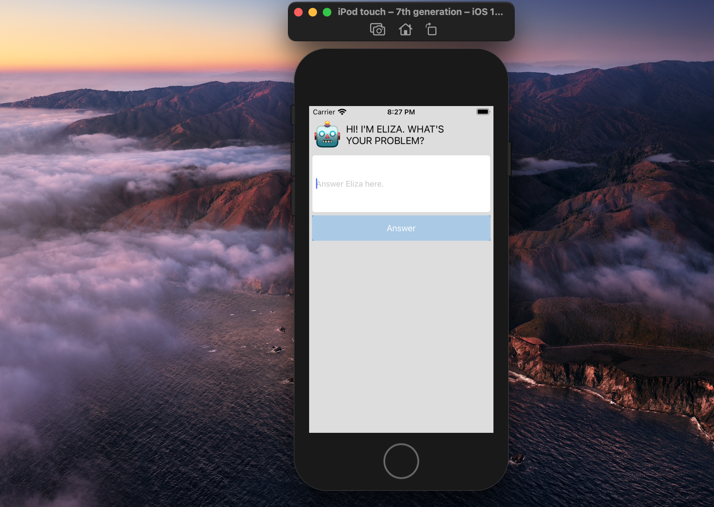

# QuestionBot
This question bot runs in Xcode in the Swift language. The program itself is that of ELIZA to make the bot talk to the user. ELIZA is an early natural language processing computer program created from 1964 to 1966 at the MIT Artificial Intelligence Laboratory by Joseph Weizenbaum.

More can be read about ELIZA from <a href="https://en.wikipedia.org/wiki/ELIZA">Wikipedia</a>.
<iframe width="560" height="315" src="https://www.youtube.com/embed/tdR5MwNURtc" title="YouTube video player" frameborder="0" allow="accelerometer; autoplay; clipboard-write; encrypted-media; gyroscope; picture-in-picture" allowfullscreen></iframe>
